# Earthquake Detection & Characterization with Deep Learning

[](https://zenodo.org/badge/latestdoi/360650102)

## Table of Contents
[1. Summary](#1.-summary)

[2. Background and Motivation](#2background-and-motivation)

[3. Data](#3.-data)

[4. Exploratory Data Analysis](#4-exploratory-data-analysis)

[5. Data Pre-processing and Image Creation for CNN model training](#5-data-pre-processing-and-image-creation-for-cnn-model-training)

[6. Earthquake Detection & Characterization using Convolutional Neural Networks (CNNs)](#6-earthquake-detection-&-characterization-using-convolutional-neural-networks-(cnns))

[7. Earthquake Detection & Characterization using Long-Short Term Memory (LSTM) networks](#7-earthquake-detection-&-characterization-using-long-short-term-memory-(lstm)-networks)

[8. Model comparison](#8-model-comparison)

[9. Deployment of earthquake detection API (FastAPI, Pydantic, Docker, ECR, ECS)](#9-deployment)

[10. Model Predictions on Live Data (Docker, ECR, Lambda)](#10-model-predictions-on-live-data)

[11. Live Predictions for seismic station at Kilauea volcano, Hawaii](#11-live-predictions)

[12. Limitations and Future Work](#12-limitations-and-future-work)

[13. Conclusions](#13-conclusions)


## 1. Summary
The goal of this project was to train and and deploy a deep learning model to classify seismic signals into two categories - _earthquake_ or _noise_, and to predict earthquake characteristics such as earthquake magnitude, P-wave arrival time, and S-wave arrival time. Two ML models were trained and evaluated:
1) A convolutional neural network (CNN) model, trained on spectrogram images of the seismic signals
2) A long-short term memory (LSTM) model, a type of recurrent neural network, trained on computed seismic signal envelopes

The CNN model was determined to be the best performing model overall, as it demonstrated greater performance on signal classification (99.01% accuracy, 99.27% precision, 98.83% recall, 99.05% F1 score) vs. the LSTM model (97.06% accuracy, 97.19% precision, 97.15% recall, 97.17% F1 score), and greater performance on earthquake magnitude prediction (0.17 MSE for the CNN vs. 0.47 MSE for the LSTM). The LSTM did perform better on predicting P-wave and S-wave arrival times (5390.10 MSE and 46720.34 MSE respectively for the CNN, and 3612.93 MSE and 44034.20 respectively for the LSTM).

To serve model predictions, I built an API (Python FastAPI, Pydantic) which takes in a 60 second seismic signal and predicts the signal class (earthquake or noise) and earthquake magntiude. I packaged the API into a Docker container and deployed it using AWS ECR and ECS.

To demonstrate the model's predictions, I created a script to fetch live seismic data from Hawaii Volcano Observatory (HVO), which monitors the actively erupting Kilauea volcano, and save snapshots of the seismic data to an S3 bucket. I built an AWS Lambda function with an S3 trigger to automatically submit the data snapshots to the model prediction API when new data is saved to the S3 bucket. During the demo, the API serving model predictions successfully predicted several local volcanic earthquakes. Examples of live data prediction are detailed below in [Section 10](#10.-model-predictions-on-live-data).

## 2. Background and Motivation
In the past, earthquake monitoring at agencies and institutions has generally relied on signal processing algorithms such as STA/LTA (Short-Term Average/Long-Term Average) and/or template matching/cross-correlation to detect earthquakes. However, these methods have limited effectiveness for small, low-magnitude earthquakes, and can be affected by noisy environments. Machine learning algorithms are gradually being adopted to improve earthquake detection, and this project demonstrates how deep learning methods can be used effectively to detect and characterize earthquakes.


## 3. Data
For this project, I used the STanford EArthquake Dataset (STEAD) (available at https://github.com/smousavi05/STEAD), a dataset containing 1.2 million seismic signals and corresponding metadata (Mousavi et al., 2019). STEAD is a high-quality global seismic dataset for which each signal has been classified as either:

1) Local earthquake (where 'local' means that the earthquakes were recorded within 350 km from the seismic station) or
2) Seismic noise that is free of earthquake signals.

Earthquakes and their p-wave and s-wave arrival times in the STEAD dataset were classified 70% manually and 30% by an autopicker. The dataset also contained a .csv file with metadata for each seismic signal comprising 35 features, including:
* network code
* receiver code
* station location
* earthquake source location
* p-wave arrival time
* s-wave arrival time
* source magnitude
* source-reciever distance
* back-azimuth of arrival
* earthquake category (i.e., 'earthquake' or 'noise')
* etc.

Each seismic sample has 3 data channels of seismic data in .h5py format along with the metadata. The three channels correspond to the north-south, east-west, and vertical components of the seismogram (the amount of ground displacement measured on each of these axes by the instrument). Each sample is 60 seconds long and sampled at 100 Hz, for a total of 6000 samples per signal. The class balance of the full STEAD dataset is 235,426 noise samples to 1,030,232 earthquake signals (about 18% noise and 82% earthquakes). To reduce this class imbalance and obtain a smaller subset of data for faster model training, = I randomly selected 100,000 signals with an even class balance of 50/50 earthquakes to noise.

## 4. Exploratory Data Analysis
Exploratory data analysis was performed on the 100,000 signals to inform modeling. An example of a single seismic waveform and spectrogram is shown below, along with a graph of its power spectral density (PSD):

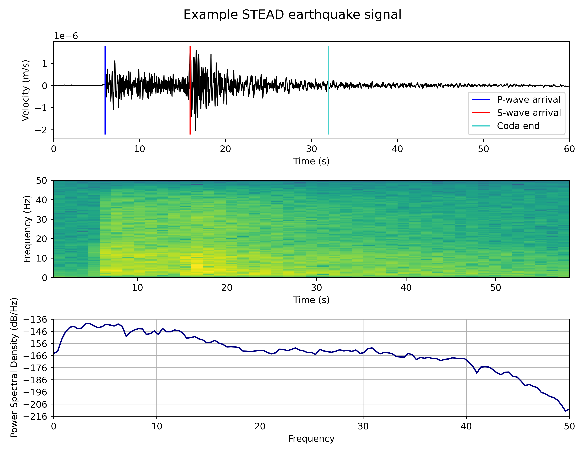

Earthquakes in the dataset ranged from -0.36 to 7.9 magnitude with an average magnitude of 1.52, ranged from -3.46 km to 341.74 km source depth with an average of 15.42 km depth, and 0 km to 336.38 km from the receiving seismic station, with an average distance of 50.58 km.

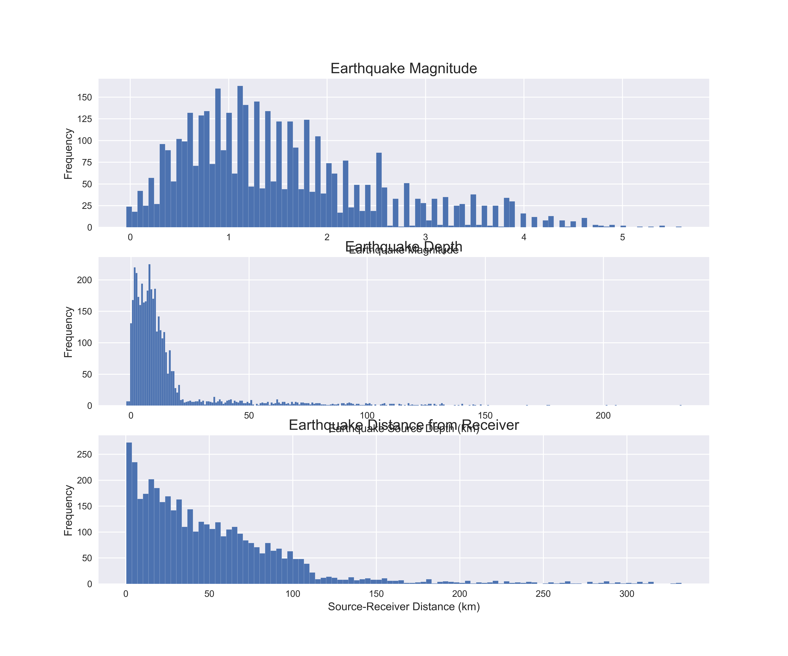

The global distribution of earthquakes in this dataset is shown here:

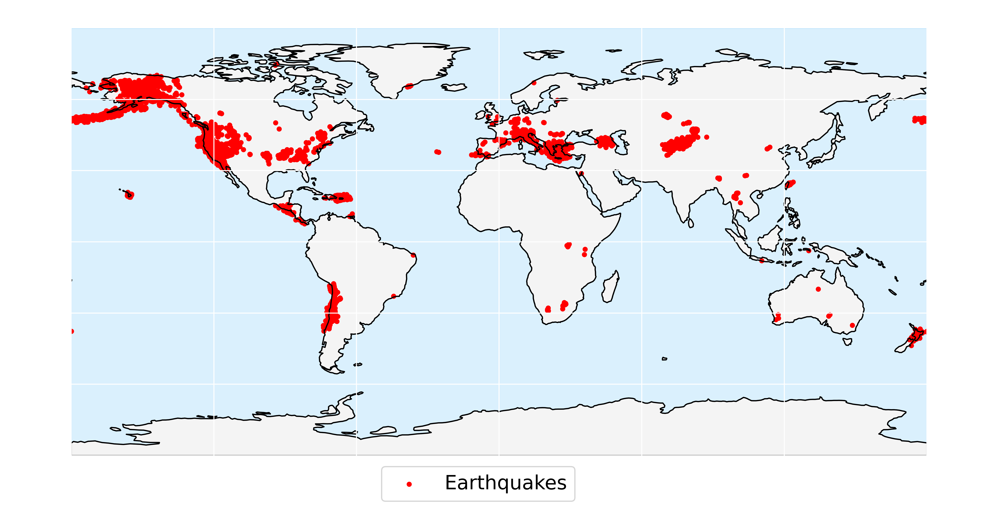


The global distribution of seismic stations which detected the earthquakes in the dataset is shown here:

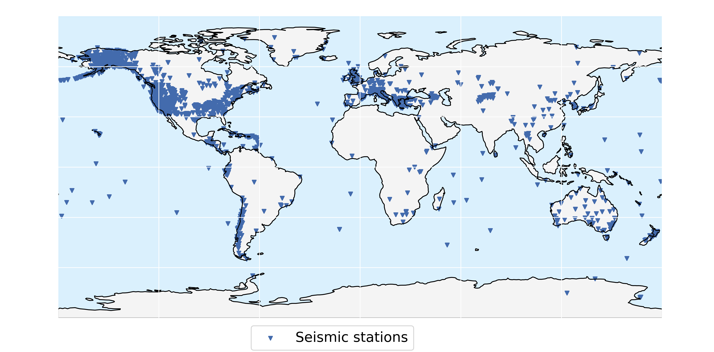


The distributions of p-wave and s-wave arrival times (in samples, where 1 second is 100 samples) is shown on the plot below. P-wave and s-wave arrival times are important because they help seismologists determine the location of the earthquake. The p-wave arrival times have a high frequency of being selected at time intervals of 100, whereas the s-wave arrival times do not display this pattern as strongly. This may affect the p-wave prediction MSE of the models later on, as the "true" data is picked at intervals of 100 samples / 1 second and the predicted times may be more granular.

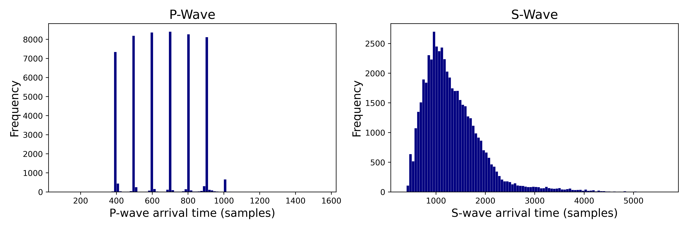

## 5. Data Pre-processing and Image Creation for CNN model training
To create images for convolutional neural network training, I plotted both the waveform and spectrogram for the vertical component of each seismogram and saved these as separate 3x2 inch images and 3x1 inch images, respectively. I normalized the color axis of the spectrograms to the range of -10 to 25 decibels per Hz for consistency across all signals. The spectrograms were created using an NFFT of 256. This pre-processing and image creation was executed using the `notebooks/data_preprocessing.ipynb` notebook in this repo, using the utilities located in the `earthquake_detection/data_preprocessing.py` module. The pre-processed images were saved in array format to S3.

Here are examples of earthquake and noise waveforms and spectrograms:

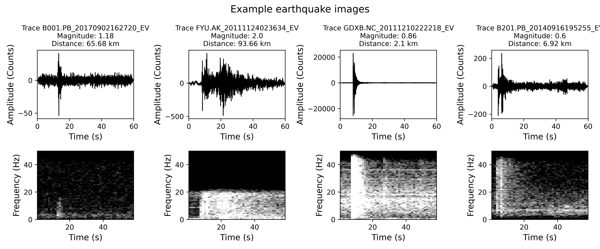
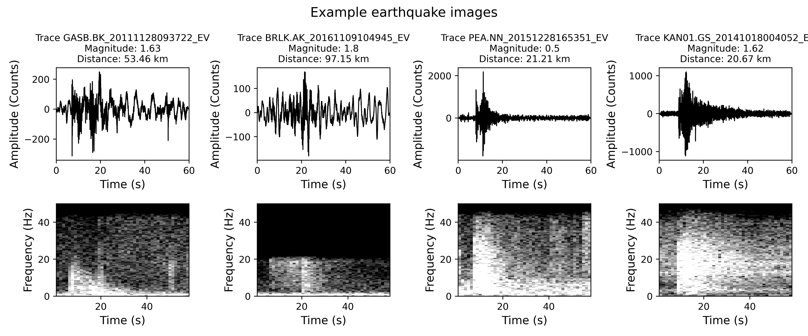
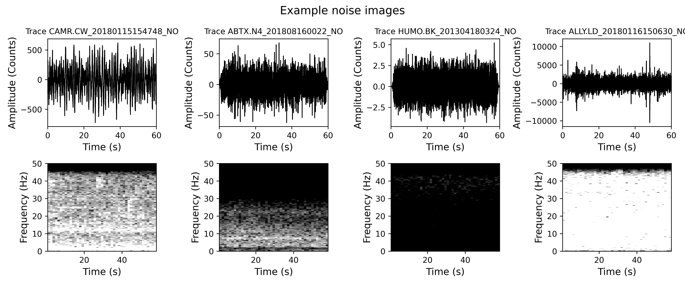
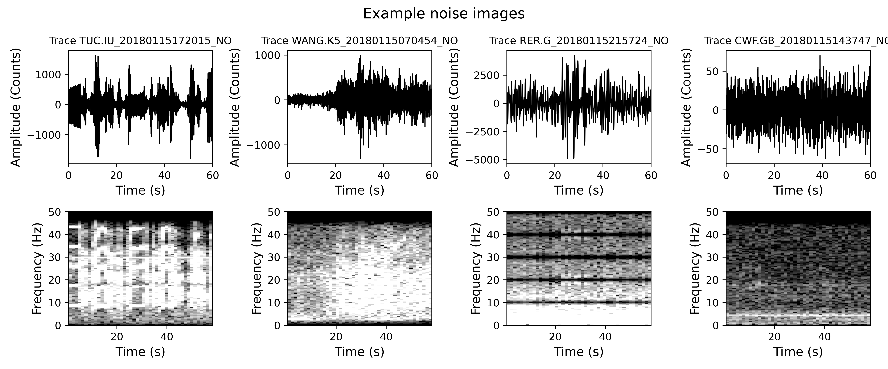

## 6. Earthquake Detection & Characterization using Convolutional Neural Networks (CNNs)
The `model_training_cnn.ipynb` notebook in this repo contains the training results and evaluation for the CNN models used to predict signal class, earthquake magnitude, P-wave arrival time, and S-wave arrival time. Training utilities, such as for the train/val/test split, model evaluation, and plotting results can be found in the `earthquake_detection/training_utils.py` module.

The model architectures can be found in the `earthquake_detection/architectures.py` module in this repo, and were the result of several rounds of architecture and hyperparameter experimentation.

### 6a. Classification CNN - 'Earthquake' or 'Noise' Prediction
The classification CNN model was trained to predict earthquake class (_earthquake_ or _noise_) using the 100,000 spectrogram images created during the data pre-processing step. A single convolutional layer was chosen for the model architecture because it resulted in excellent predictive power, as well as faster training and inference speed than multiple convolutional layers.

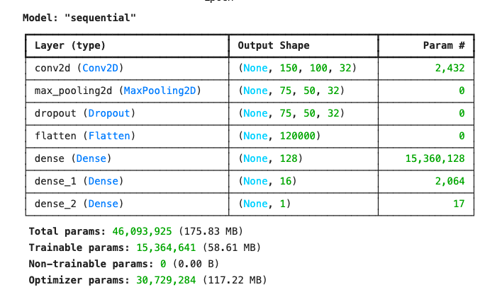

#### Results
Evaluating the best CNN model on the test set (20k samples) produced the following results:
```
Accuracy: 99.01%
Precision: 99.27%
Recall: 98.83%
F1 Score: 99.05%
```

Confusion matrix, bar chart, and ROC curve for the test set:
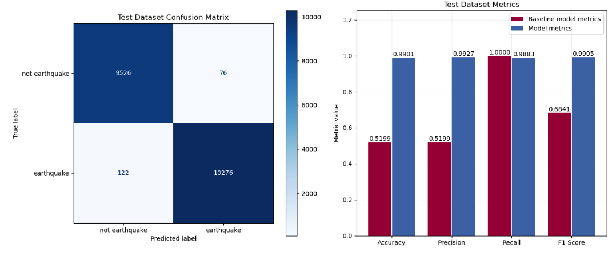

This CNN model performed extremely well at predicting signal class, with only 76 false positives and 122 false negatives out of a test set of the ~20,000 test signals evaluated.

The model loss and model accuracy of the training and validation set during model training:
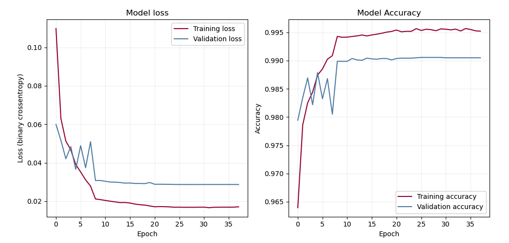

### 6b. Regression CNN - Earthquake Magnitude Prediction
A regression CNN model was trained to predict earthquake magnitude using the ~50,000 earthquake spectrogram images created during the data pre-processing step. A single convolutional layer was chosen for the model architecture because it resulted in good predictive power, as well as faster training and inference speed than multiple convolutional layers.

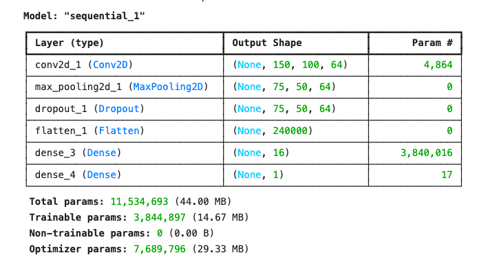

#### Results
Evaluating the best CNN model on the test set (10k samples) produced the following results:
```
Baseline MSE (MSE if only the average magnitude of the training set was predicted each time): 0.95
Model MSE: 0.17

Baseline MAE (MAE if only the average magnitude of the training set was predicted each time): 0.77
Model MAE: 0.29
```

Plots of model results for the test set:


As shown on the plots above, the model's MSE and MAE for earthquake magnitude are significantly lower than the baseline. The plot of predicted vs. observed magnitude shows how well the regression model performed visually, with the predictions generally falling around the dashed black line of best fit, though there are some larger outliers.

The model loss and mean absolute error of the training and validation set during model training are shown below:
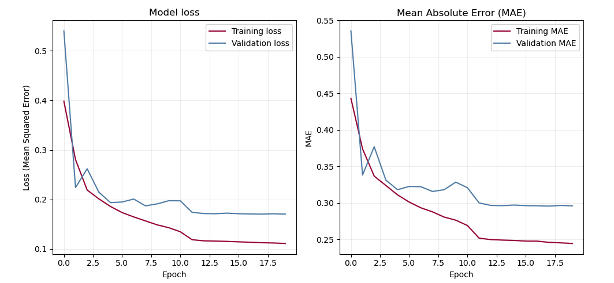


### 6c. Regression CNN - P-Wave and S-Wave Arrival Time Prediction
A regression CNN model was trained to predict earthquake P-wave and S-wave arrival times, using the ~50,000 earthquake waveform images created during the data pre-processing step. A single convolutional layer was chosen for the model architecture because it resulted in good predictive power, as well as faster training and inference speed than multiple convolutional layers.

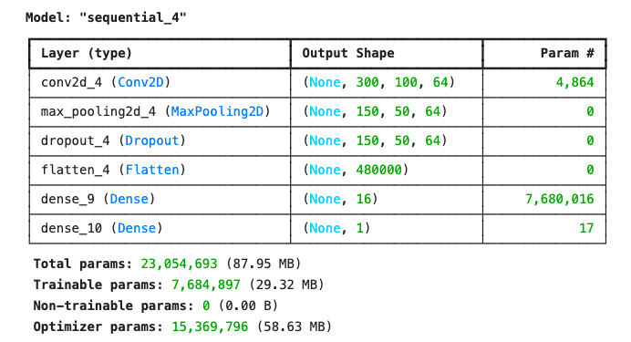

#### Results: P-wave arrival time
Evaluating the best CNN model on the test set (10k samples) produced the following results:
```
Baseline MSE (MSE if only the average P-wave arrival was predicted each time): 30683.12
Model MSE: 5390.10

Baseline MAE (MAE if only the average P-wave arrival was predicted each time): 152.34
Model MAE: 51.21
```

Plots of model results for the test set:
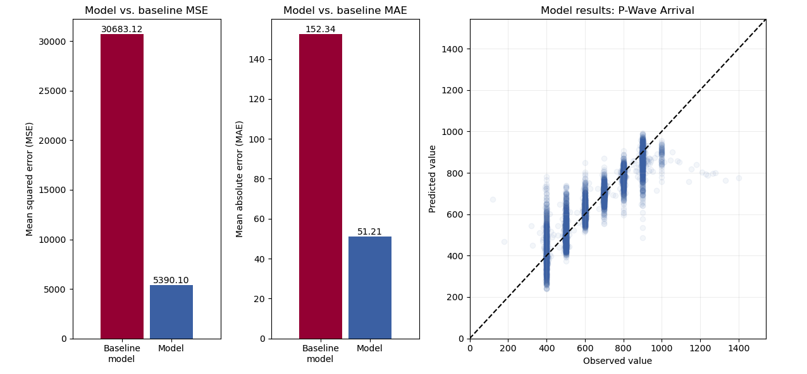

As shown on the plots above, the model's MSE and MAE for earthquake P-wave arrival time are lower than the baseline. The plot of predicted vs. observed P-wave arrival time shows how well the regression model performed visually. The predictions generally fall in the vicinity of the dashed black line of best fit, though the true observed values cause a bucketed effect. In the STEAD training set, P-wave arrival times were mostly limited to 100 sample (1 second) labels, so this model retains this limitation in its predictions.

The model loss and mean absolute error of the training and validation set during model training are shown below:
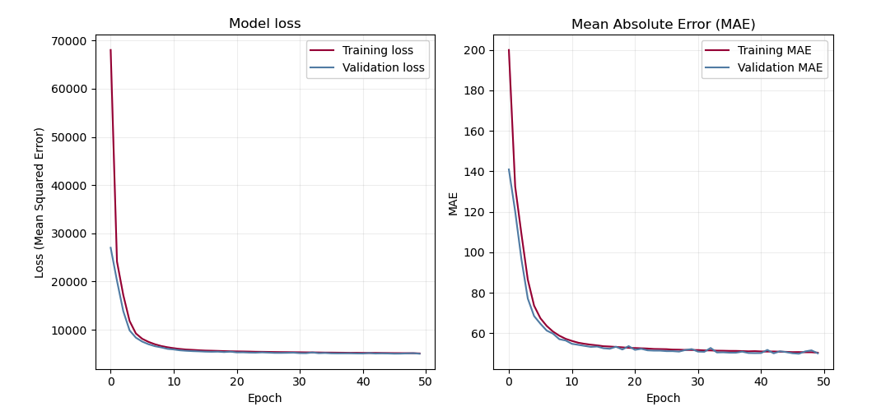

#### Results: S-wave arrival time
Evaluating the best CNN model on the test set (10k samples) produced the following results:
```
Baseline MSE (MSE if only the average S-wave arrival was predicted each time): 373828.92
Model MSE: 46720.34

Baseline MAE (MAE if only the average S-wave arrival was predicted each time): 450.76
Model MSE: 133.30
```

Plots of model results for the test set:
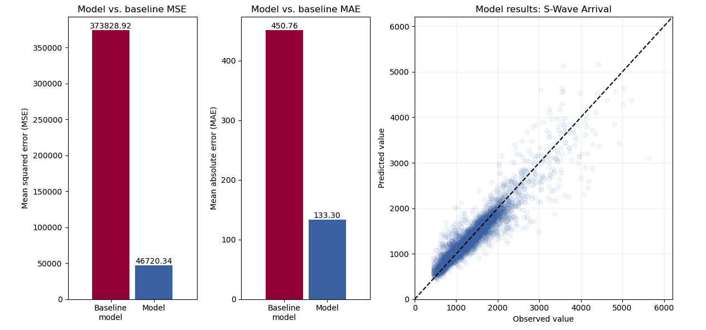

As shown on the plots above, the model's MSE and MAE for earthquake S-wave arrival time are lower than the baseline. The plot of predicted vs. observed S-wave arrival time shows how well the regression model performed visually, with the predictions generally falling around the dashed black line of best fit, though there are some larger outliers, especially at larger observed values of S-wave arrival time.

The model loss and mean absolute error of the training and validation set during model training are shown below:
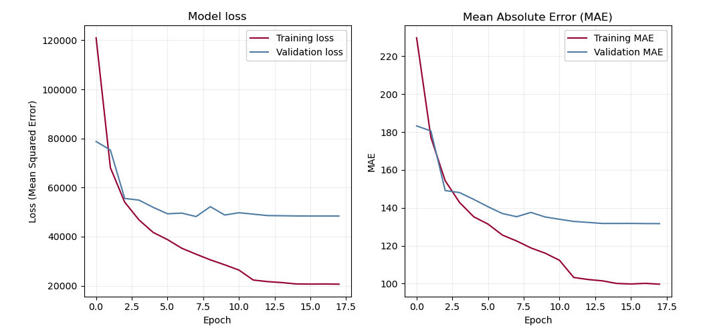


## 7. Earthquake Detection & Characterization using Long-Short Term Memory (LSTM) networks
To try to remove the need to create and store signal images in order to train a model, I created two types of LSTM models, which are a type of recursive neural network (RNN) model designed specifically to mitigate the exploding gradient problem common with RNNs.

Preliminary testing showed that the full 6000 sample signals of the STEAD dataset were too long and too noisy for the LSTM to predict well. So, the following pre-processing technique was used to convert the signals to format better suited for LSTM model training:

1. Using the same 100,000 signal dataset as for the CNN models above, applied a 1-50 Hz Butterworth bandpass filter to each signal to reduce environmental noise
2. Applied a Hilbert transform to get the positive signal envelope (a smooth curve outlining the positive extremes of the signal)
3. Calculated the 2-second rolling mean of the envelope
4. De-meaned the rolling avermean by subtracting the overall mean
5. Resampled the envelope to 300 samples from the original 6000 samples

Here is an example of a signal (gray) with its calculated envelope (dark red) and P-wave and s-wave arrival times shown. Note how the P-wave and S-wave arrivals correspond with a sharp increase in slope of the envelope:

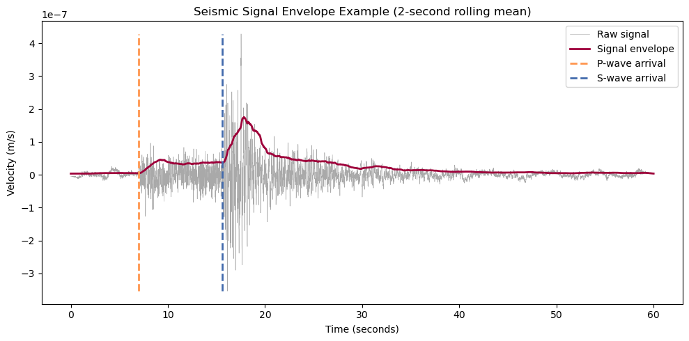

### 7a. Classification LSTM - 'Earthquake' or 'Noise' Prediction
The classification LSTM model was trained to predict earthquake class (_earthquake_ or _noise_) using the 100,000  signal envelope vectors created during the data pre-processing step.

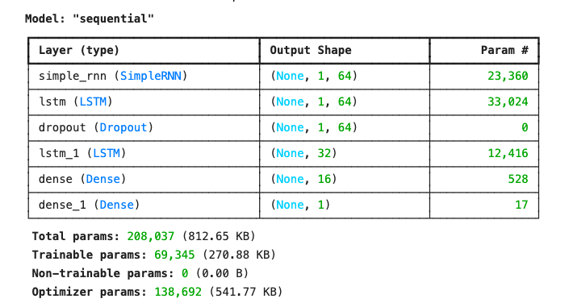

#### Results
Evaluating the best classification LSTM model on the test set (20k samples) produced the following results:
```
Accuracy: 97.06%
Precision: 97.19%
Recall: 97.15%
F1 Score: 97.17%
```

Confusion matrix, bar chart, and ROC curve for the test set:
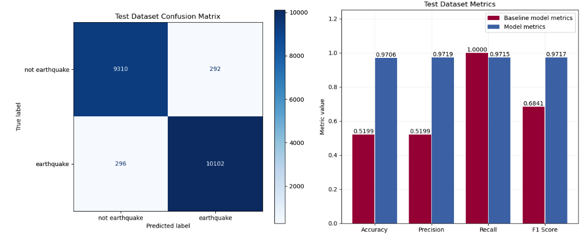

This LSTM model performed very well in predicting signal class, though fell slightly short of the metrics achieved by the CNN models discussed above. There were only 292 false positives and 296 false negatives out of the ~20,000 test signals evaluated.

The model loss and model accuracy of the training and validation set during model training:
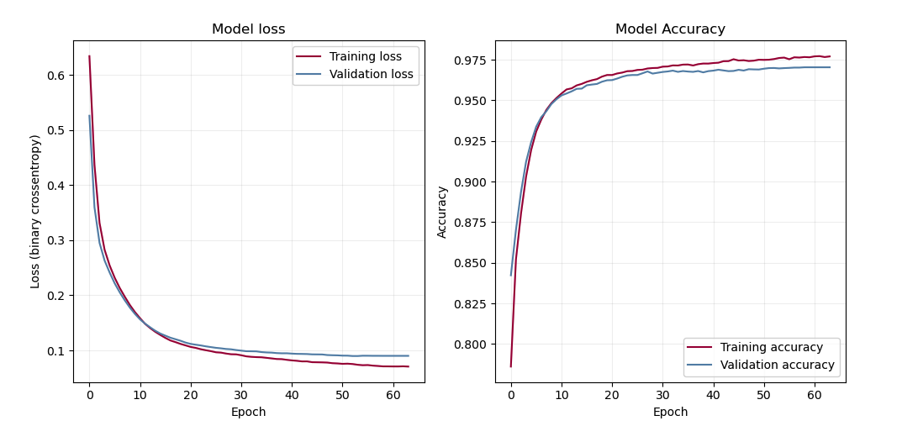

### 7b. Regression LSTM - Earthquake Magnitude, P-Wave, and S-Wave Prediction
A regression LSTM model was trained to predict earthquake magnitude, P-wave arrival time, and S-wave arrival time, using the ~50,000 earthquake signal envelope vectors created during the data pre-processing step.

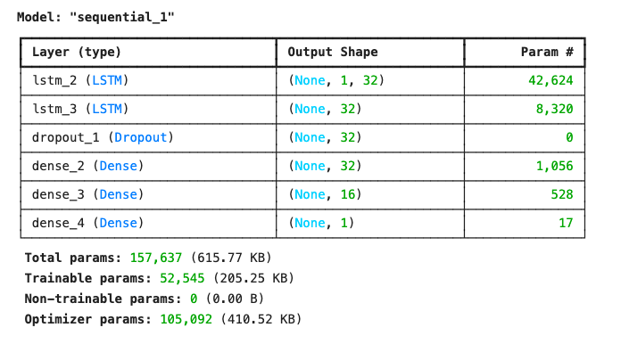

#### Results: Earthquake magntiude prediction
Evaluating the best LSTM model on the test set (10k samples) produced the following results:
```
Baseline MSE (MSE if only the average earthquake magnitude of the training set was predicted each time): 0.95
Model MSE: 0.47

Baseline MAE (MAE if only the average average earthquake magnitude of the training set was predicted each time): 0.77
Model MSE: 0.51
```

Plots of model results for the test set:
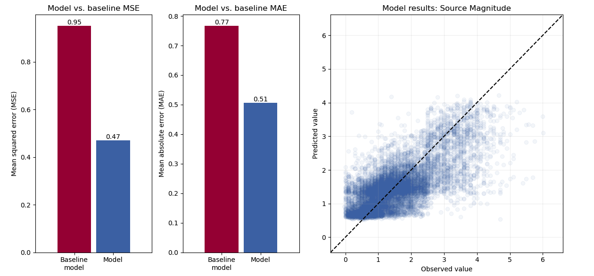

As shown on the plots above, the model's MSE and MAE for earthquake magnitude are lower than the baseline, though the plot of predicted vs. observed magnitude shows that the predicted vs. observed values do not generally conform to the line of best fit. This indicates that this LSTM model is less suitable for earthquake magnitude prediction than the CNN models above.

The model loss and mean absolute error of the training and validation set during model training are shown below:
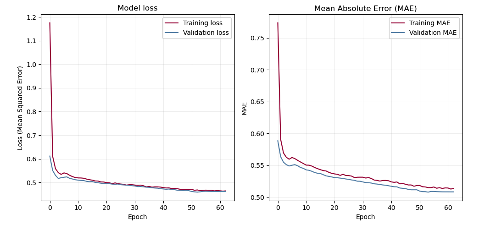

#### Results: P-wave arrival time
Evaluating the best LSTM model on the test set (10k samples) produced the following results:
```
Baseline MSE (MSE if only the average P-wave arrival of the training set was predicted each time): 30589.82
Model MSE: 3612.93

Baseline MAE (MAE if only the average P-wave arrival was predicted each time): 152.00
Model MSE: 35.93
```

Plots of model results for the test set:
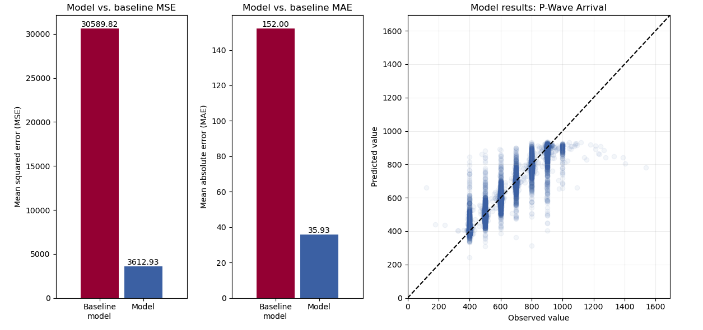

As shown on the plots above, the model's MSE and MAE for earthquake P-wave arrival time are lower than the baseline. In the STEAD training set, P-wave arrival times were mostly limited to 100 sample (1 second) labels, so this model retains this limitation in its predictions. The plot of predicted vs. observed P-wave arrival time shows that the predictions are in the vicinity of the best-fit line, but that this model does not perfectly predict the P-wave arrival time values.

The model loss and mean absolute error of the training and validation set during model training are shown below:
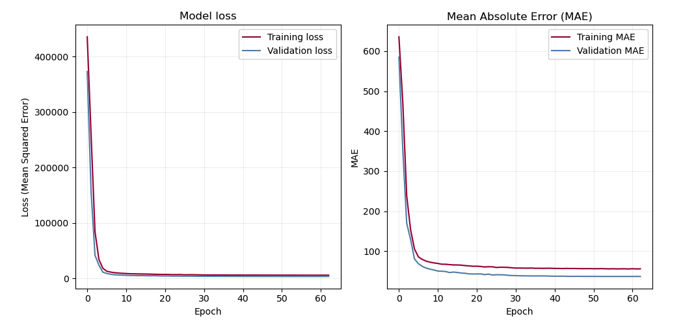

#### Results: S-wave arrival time
Evaluating the best LSTM model on the test set (10k samples) produced the following results:
```
Baseline MSE (MSE if only the average S-wave arrival of the training set was predicted each time): 372616.23
Model MSE: 44034.20

Baseline MAE (MAE if only the average S-wave arrival of the training set was predicted each time): 450.01
Model MSE: 107.57
```

Plots of model results for the test set:
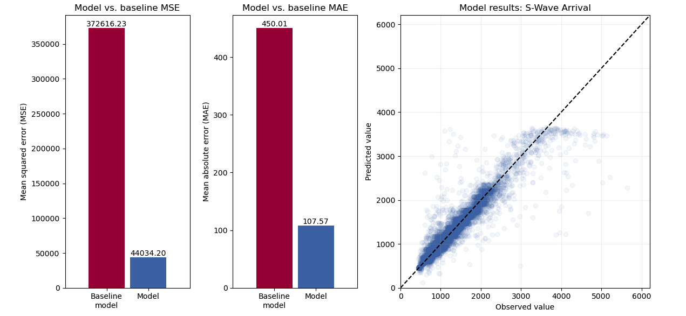

As shown on the plots above, the model's MSE and MAE for earthquake S-wave arrival time are lower than the baseline. The plot of predicted vs. observed S-wave arrival time shows how well the regression model performed visually, with the predictions generally falling around the dashed black line of best fit, though there are some larger outliers, especially at larger observed values of S-wave arrival time.

The model loss and mean absolute error of the training and validation set during model training are shown below:
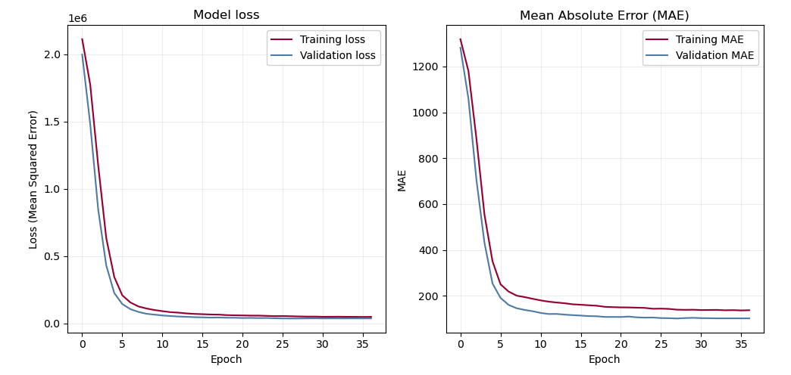

## 8. Model comparison
#### Classification model comparison:
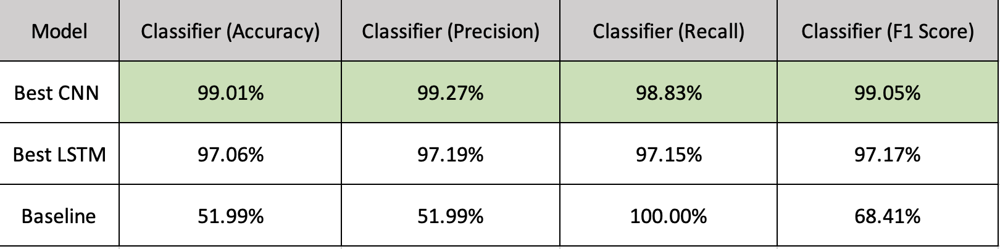

#### Regression model comparison:
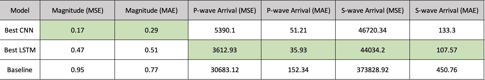

Overall, the CNN models performed best on predicting signal class and earthquake magntiude, while the LSTM models performed best at predicting P-wave and S-wave arrival times. Both types of models outperformed the baseline metrics, which are the metrics produced by simply predicting the most common signal class in the training set (for the classification problem) or the average value of the training set (for the regression problem).

Since for this project I was most interested in signal class and earthquake magnitude, the CNN models were the ones deployed for use in real-time prediction.

## 9. Deployment
I completed the following steps to deploy the CNN models for real-time prediction:

1. Designed and built an API using Python's FastAPI, with Pydantic for payload/response validation and Uvicorn for serving. The API accepts a 6000-sample (60 second) signal vector and optional sampling frequency as a payload, and returns the predicted singal class (_earthquake_ or _noise_) and the earthquake magnitude if the signal is predicted to be an earthquake. The API applies pre-processing steps to transform the input from a signal vector to a spectrogram image of the correct size, and applies post-processing steps to the response. This API See `deployments/serving` in this repo for API code.
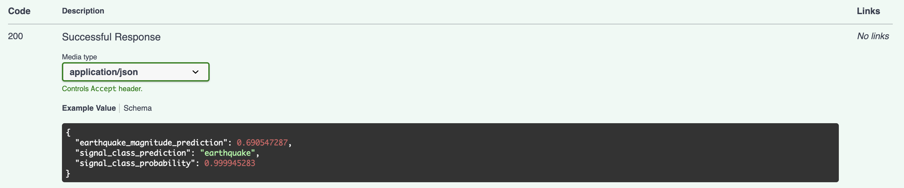

2. Packaged the API into a Docker container. See `deployments/Dockerfile` for code.

3. Pushed the Docker image to AWS ECR, a managed Docker container registry for storing Docker images.

4. Created an AWS ECS cluster and task definition, configured an application load balancer, and started the ECS task to serve the API.

## 10. Model Predictions on Live Data
To demonstrate the effectiveness of the model predictions in real-time, I created a `live_model_predictions/fetch_live_data.py` script to fetch seismic data from the Incorporated Research Institutions for Seismology (IRIS) SeedLink client using the Obspy package for Python. Here is how the script gets live data from the selected station:

```
# specify client (IRIS) to retrieve data from
client = create_client('rtserve.iris.washington.edu', on_data=handle_data)

# specify stream
client.select_stream('HV', 'AHUD', 'EHZ') # network, station, channel

# run the client, this will begin streaming the data
client.run()

```

I selected the Hawaiian Volcano Observatory ("HV") network because it has stations located on Kilauea, an actively erupting shield volcano. Due to Kilauea's eruption and active magma plumbing system, earthquakes occur very frequently compared to a regular tectonic fault system, making this an excellent location for detecting local earthquakes in real-time. I selected the "AHUD" station and "EHZ" channel, which is an extremely short-period, high-gain seismometer with a vertical orientation (like the train/test data used to fit and evaluate the model).

The USGS Hawaiian Volcano Observatory map shows seismometers (black triangles) and recent earthquakes (circles) at Kilauea volcano. This map and earthquake report list is available at https://www.usgs.gov/volcanoes/kilauea?date=2week&inst=101740:

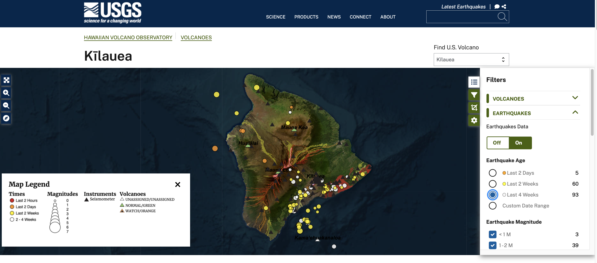

The map below shows the location of the AHUD station, located southeast of Kilauea's summit caldera, along the east rift zone:

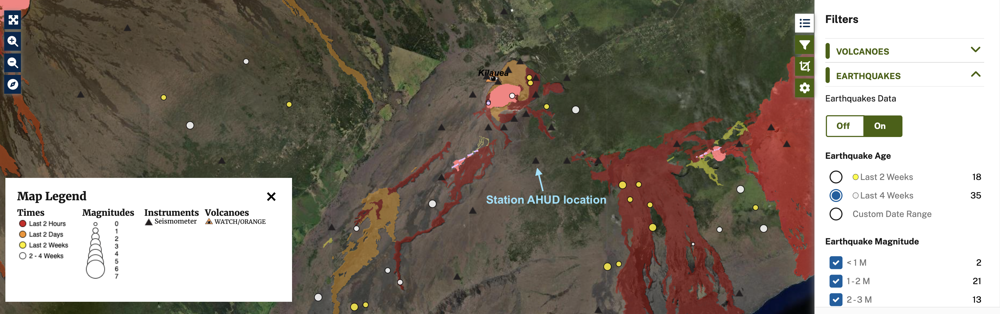

The `live_model_predictions/fetch_live_data.py` script reads in the live stream of seismic data, taking snapshots of the data in 6000-sample (60 second) intervals, with a sliding window of 60 samples (6 seconds). The data snapshots are automatically uploaded to an AWS S3 bucket.

### 10b. Live data prediction deployment with Docker and AWS Lambda
To generate model predictions on the live stream of seismic data in real time, I used the following steps:
1. Created a Lambda function script in `live_model_predictions/lambda_function.py` with an S3 trigger that automatically triggers the Lambda function to run whenever a seismic signal file is uploaded to the S3 bucket. The Lambda function fetches the seismic signal file, formats the earthquake detection API payload, requests a response from the API, prints the API response, and saves a plot of the requested signal and response to an S3 path.
2. Dockerized the Lambda function and pushed it to AWS ECR
3. Ran the `live_model_predictions/fetch_live_data.py` script to start real-time predictions.

### 10b. Live predictions
Here are some examples of live predictions on the seismic station data stream using the Lambda function and earthquake detection API in this repo.

#### Earthquake 1
This earthquake was a 1.71 magnitude local volcanic earthquake that occurred at 2025-02-18 23:24:15 UTC at Kilauea.

```
Predictions for trace HV_AHUD_EHZ_100.0Hz_2025-02-18T23:24:06.940000Z_2025-02-18T23:25:06.940000Z:

    class: earthquake,
    class probability: 0.867120922,
    earthquake magnitude: 1.11603117
```

Below is a slideshow video showing the sequence of signal snapshots in spectrogram image format and predictions surrounding the earthquake. The mostly black spectrogram images with lighter areas of at low frequencies are noise, and the appearance of a light-colored pulse at higher frequencies indicates an earthquake:

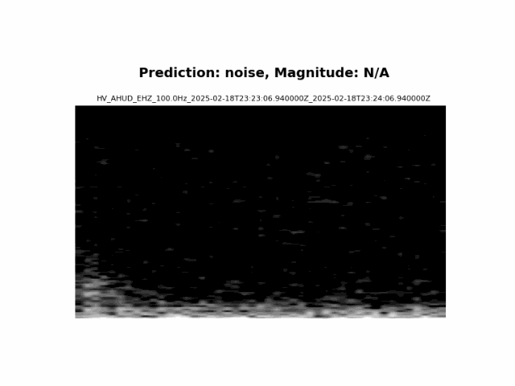

Here is the corresponding earthquake report from the USGS HVO:

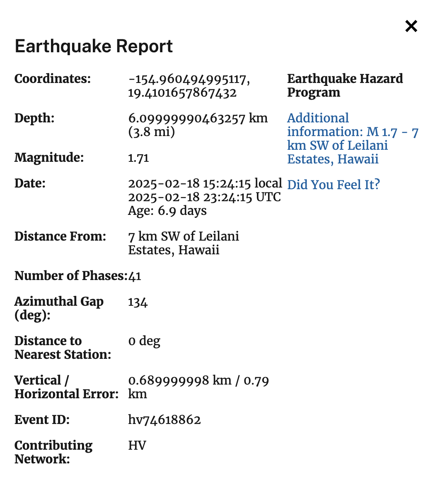

The live model prediction gave the signal an 0.8671 probability of being an earthquake, and estimated a magnitude of 1.116, which is near the true magnitude of 1.71.

#### Earthquake 2
This earthquake was a 0.56 magnitude local volcanic earthquake that occurred at 2025-02-27 19:48:31 UTC at Kilauea.

```
Predictions for trace HV_AHUD_EHZ_100.0Hz_2025-02-27T19:48:22.120000Z_2025-02-27T19:49:22.120000Z:

class: earthquake,
class probability: 0.815437317,
earthquake magnitude: 0.485444099
```

Below is a slideshow video showing the sequence of signal snapshots in spectrogram image format and predictions surrounding the earthquake.

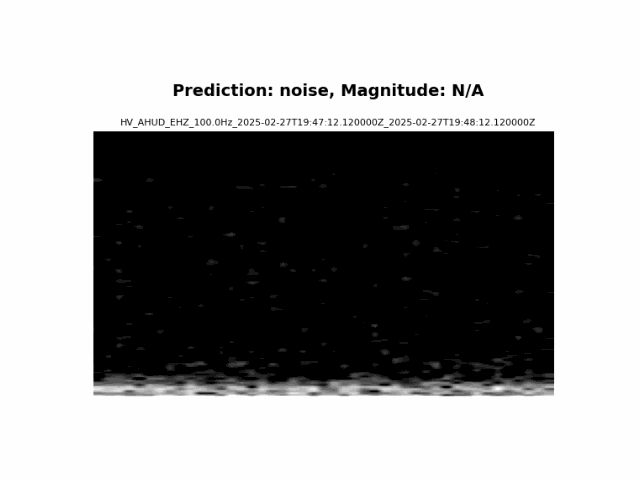

Here is the corresponding earthquake report from the USGS HVO:

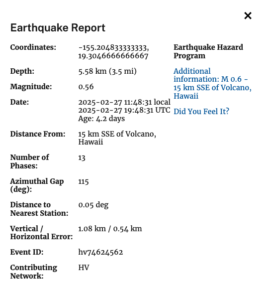

The live model prediction gave the signal an 0.815 probability of being an earthquake, and estimated a magnitude of 0.485, which is near the true magnitude of 0.56.

#### Earthquake 3
This earthquake was a 2.06 magnitude earthquake that occurred at 2025-02-27 13:01:56 UTC SSW of Pahala, Hawaii.

```
Predictions for trace HV_AHUD_EHZ_100.0Hz_2025-02-27T13:01:52.120000Z_2025-02-27T13:02:52.120000Z:

class: earthquake,
class probability: 0.999992967,
earthquake magnitude: 1.43064
```

Below is a slideshow video showing the sequence of signal snapshots in spectrogram image format and predictions surrounding the earthquake.

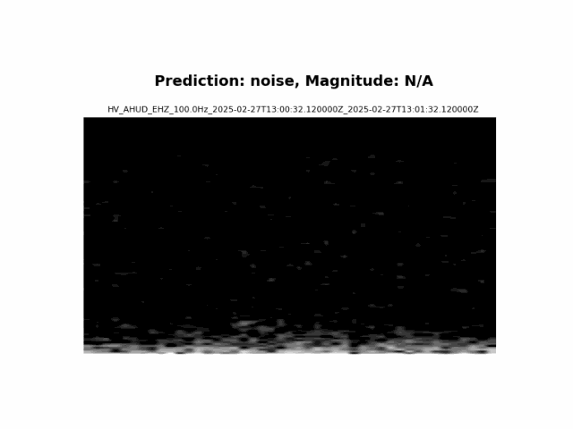

Here is the corresponding earthquake report from the USGS HVO:

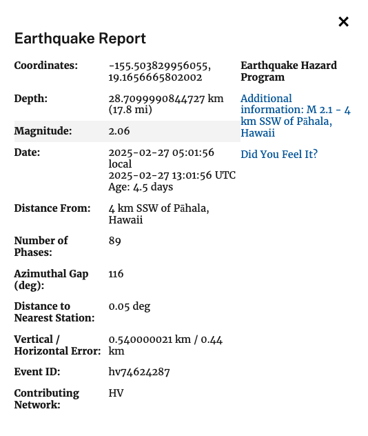

The live model prediction gave the signal a 0.999992967 probability of being an earthquake, and estimated a magnitude of 1.43, which is near the true magnitude of 2.06.


## 11. Limitations and Future Work

A limitation that is visible in the live prediction videos above is that the model was trained on a training set of data with an average P-wave arrival time of ~7 seconds from the start of the signal trace, meaning that it is best at predicting signal class when the snapshot shows the earthquake near the start of the 60 second window. When an earthquake appears at the end of the 60 second window, the model often does not recognize it as an earthquake until it approaches the beginning of the snapshot window. In future work, we would like to add data augmentations to the training set to randomly offset the signal start time, making this model more generalizable to earthquakes appearing in different segments of the snapshot window.

## 12. Conclusions

For this project, I created two types of models: CNN models and LSTM models (a type of RNN model). Each of these models had two types, classification and regression. These were used to predict the class of a signal as either _earthquake_ or _noise_, the earthquake magnitude, P-wave arrival times, and S-wave arrival times. The best classification model was the CNN classifier, which had 99.01% accuracy, 99.27% precision, 98.83% recall, and 99.05% F1 score, metrics that far exceeded the baseline values.

The best CNN classification model was connected to a live stream of data from Kilauea volcano in Hawaii, an area with frequent (daily) local volcanic earthquakes, to monitor earthquakes in real time. The live data script generates seismic signal snapshots representing 60 seconds of signal with a 6 second sliding window, and deposits the images to an S3 bucket. An AWS Lambda function with an S3 trigger fetches the signal trace, packages into a payload for the earthquake detection API built in this repo, and requests model prediction responses from the API. The API returns responses in both text and image format, predicting signal class and earthquake magnitude. An example of an earthquake from from February 18, 2025 is shown above, where the earthquake correctly predicted.


## 13. References

Mousavi, S. M., Sheng, Y., Zhu, W., Beroza G.C., (2019). STanford EArthquake Dataset (STEAD): A Global Data Set of Seismic Signals for AI, IEEE Access, doi:10.1109/ACCESS.2019.2947848


#### Copyright 2025 Kaelynn Rose
