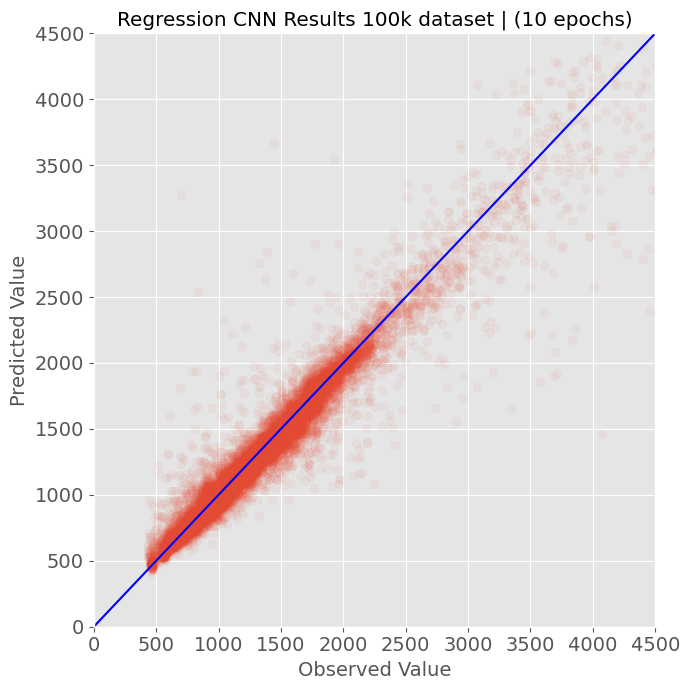
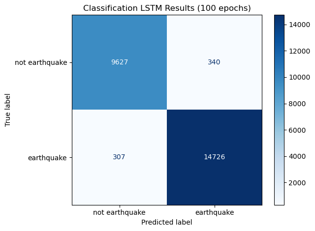

# Earthquake Detection with Deep Learning


## Introduction

The goal of this study is to train a convolutional neural network using over 100,000 seismic signal images, to classify signals into 'earthquake' and 'noise' categories and to predict characteristics such as earthquake magnitude, earthquake p-wave arrival time, and earthquake s-wave arrival time. Additionally, the best model was deployed using an AWS Lambda function and connected to a seismic data stream to predict signal classes in near-real time. This study has potential applications for faster earthquake detection.

#### CRISP-DM Process

_Business understanding_ – A company or institution that performs earthquake monitoring could use these models and analysis for implementing deep learning into their monitoring algorithms, which have traditionally been based off of signal amplitude short-term-average/long-term-average (STA/LTA) algorithms to flag earthquakes. These models could result in faster or more accurate detection of earthquakes.

_Data understanding_ – The full dataset consists of over 1.2 million seismic signals from the STanford EArthquake Dataset (STEAD), available here: https://github.com/smousavi05/STEAD. This is a labeled dataset that has applications for testing many other types of machine learning on seismic signals.

_Data preparation_ – The seismic data was used to create 100,000 seismic data images, which were used to train the models.

_Modeling_ – Two types of models were used: CNN models and LSTM models were used to classify signals as 'earthquake' or 'noise', and predict earthquake magnitude, p-wave arrival time, and s-wave arrival time.

_Evaluation_ – The models were evaluated using accuracy/precision/recall for the classification models, and mean-squared-error (MSE) loss for the regression models. The best models for each case had good performance on the training and test datsets.

_Deployment_ – The best classification model (the CNN model) was containerized using Docker and deployed using an AWS Lambda function and s3 bucket. The Lambda function was connected to a live data stream for near-real time predictions.

## Data

For this study, I used the STanford EArthquake Dataset (STEAD) (available at https://github.com/smousavi05/STEAD), a dataset containing 1.2 million seismic signals and corresponding metadata. STEAD is a high-quality global seismic dataset for which each signal has been classified as either:

1) Local earthquakes (where 'local' means that the earthquakes were recorded within 350 km from the seismic station) or 
2) Seismic noise that is free of earthquake signals. 

Earthquakes and their p-wave and s-wave arrival times in the STEAD dataset were classified 70% manually and 30% by an autopicker. The dataset also contained a .csv file with metadata for each seismic signal comprising 35 features, including:
* network code
* receiver code
* station location
* earthquake source location
* p-wave arrival time
* s-wave arrival time
* source magnitude
* source-reciever distance
* back-azimuth of arrival
* earthquake category (i.e., 'earthquake' or 'noise')
* etc.

Each seismic sample has 3 data channels of seismic data in .h5py format along with the metadata. The three channels correspond to the north-south, east-west, and vertical components of the seismogram (the amount of ground displacement measured on each of these axes by the instrument). Each sample is 60 seconds long and sampled at 100 Hz, for a total of 6000 samples per signal. Since the class balance of the full STEAD data is 235,426 noise samples to 1,030,232 earthquake signals (about 18% noise and 82% earthquakes), I randomly sampled 400,000 earthquake signals from the full earthquake dataset and used all 235,426 noise samples to create a closer class balance of 37% noise to 63% earthquakes for a total dataset of 635426 samples (about half the original dataset). Of these samples, 100,000 were randomly selected to train each model.

### Exploratory Data Analysis

Exploratory data analysis was performed on the 100,000 signals to inform modeling. An example of a single seismic waveform and spectrogram is shown below, along with a graph of its power spectral density (PSD):

 

Earthquakes in the dataset ranged from -0.36 to 7.9 magnitude with an average magnitude of 1.52, ranged from -3.46 km to 341.74 km source depth with an average of 15.42 km depth, and 0 km to 336.38 km from the receiving seismic station, with an average distance of 50.58 km.

 

The global distribution of earthquakes in this dataset is shown here:
 

The global distribution of seismic stations which detected the earthquakes in the dataset is shown here:
 

The distributions of p-wave and s-wave arrival times (in samples, where 1 second is 100 samples) is shown on the plot below. P-wave and s-wave arrival times are important because they help seismologists determine the location of the earthquake. The p-wave arrival times have a high frequency of being selected at time intervals of 100, whereas the s-wave arrival times do not display this pattern as strongly. This may affect the p-wave prediction MSE of the models later on, as the "true" data is picked at intervals of 100 samples / 1 second and the predicted times may be more granular.

 


### Image Creation

**CNN Classification & Earthquake Magnitude Prediction Regression Images**

To create images for training the convolutional neural network, I plotted both the waveform and spectrogram for the vertical component of each seismogram and saved these as separate 3x2 inch images, with the waveform images being 110x160 pixels and the spectrograms being 100x150 pixel images. I normalized the color axis of the spectrograms to the range of -10 to 25 decibels per Hz for consistency across all signals. The spectrograms were created using an NFFT of 256. These signals were plotted using the _plot_images.py_ file contained in this repo.

Here are examples of earthquake and noise spectrograms that were used to train the CNN classification and magnitude prediction models:
 

**CNN P-Wave and S-Wave Prediction Regression Images**

Since the p-wave and s-wave arrival times can be quite close together at the scale of the images used previously, I created a new set of images using 6x2 inch dimensions. The waveform images were used since preliminary testing showed that the CNN models trained with the waveforms rather than the spectrograms for p-waves and s-waves showed better prediction results.

Here are examples of earthquake and noise waveforms that were used to train the CNN p-wave and s-wave prediction models:
 

## Classification CNN - 'Earthquake' or 'Noise' Prediction

The spectrogram images were labeled with values of 'earthquake' or 'noise'. I created and tested a classifying convolutional neural network model on a subset of 100,000 randomly chosen images from the set, using the _seismic_CNN.py_ script in this repo. The script first imports the 100,000 randomly chosen images from the directory, performs a train-test split, compiles and then fits a classification cnn model, and then evaluates and saves the model and produces evaluation figures so model performance can be inspected visually. The model uses callbacks to save the partially-trained model at the end of each epoch.

```
Baseline model: The accuracy of the baseline model for earthquake vs. noise
prediction is is 0.53704, the precision is 0.6359130766298132, and the recall is
0.6322173089071383

Best model: The accuracy of the classification model for earthquake vs. noise
prediction is 0.98532, the precision is 0.9907954040500222, and the recall is
0.9859759949463045

```

The best model had the following CNN structure:

```
Model: "sequential_19"
_________________________________________________________________
Layer (type)                 Output Shape              Param #   
=================================================================
conv2d_6 (Conv2D)            (None, 100, 150, 32)      832       
_________________________________________________________________
max_pooling2d_6 (MaxPooling2 (None, 50, 75, 32)        0         
_________________________________________________________________
dropout_24 (Dropout)         (None, 50, 75, 32)        0         
_________________________________________________________________
flatten_6 (Flatten)          (None, 120000)            0         
_________________________________________________________________
dense_54 (Dense)             (None, 64)                7680064   
_________________________________________________________________
dense_55 (Dense)             (None, 16)                1040      
_________________________________________________________________
dense_56 (Dense)             (None, 2)                 34        
=================================================================
Total params: 7,681,970
Trainable params: 7,681,970
Non-trainable params: 0
_________________________________________________________________
```

For the use case of using this model to detect earthquakes in near-real-time, we would want to have a balance between minimizing false negatives and false positives so that we could classify earthquakes correctly but also not classify every noise signal as an earthquake. For this case, we look at the accuracy metric since it gives us the proportion of true positives and true negatives identified by the model.

Evaluating the test set produced the following confusion matrix:

 


The plot below shows the model accuracy history over 50 epochs:

 


## Regression CNN - Earthquake Magnitude Prediction

For the regression CNN, I used 100,000 spectrogram images and the target variable of earthquake magnitude. I created and tested a regression convolutional neural network model on the 100,000 image set, using the _seismic_CNN.py_ script in this repo. The script first imports the 100,000 randomly chosen images from the directory, performs a train-test split, compiles and then fits a regression cnn model using the specified target, and then evaluates and saves the model and produces evaluation figures. The model uses callbacks to save the partially-trained model at the end of each epoch.

```
Baseline model: The baseline mse for earthquake magnitude is 0.9501049752369152  

Best model: The mse of the CNN regression for earthquake magnitude is 0.15895192325115204 

```

The best model had the following structure:
```
Model: "sequential_1"
_________________________________________________________________
Layer (type)                 Output Shape              Param #   
=================================================================
conv2d_1 (Conv2D)            (None, 100, 150, 64)      1664      
_________________________________________________________________
max_pooling2d_1 (MaxPooling2 (None, 50, 75, 64)        0         
_________________________________________________________________
dropout_1 (Dropout)          (None, 50, 75, 64)        0         
_________________________________________________________________
flatten_1 (Flatten)          (None, 240000)            0         
_________________________________________________________________
dense_3 (Dense)              (None, 16)                3840016   
_________________________________________________________________
dense_4 (Dense)              (None, 1)                 17        
=================================================================
Total params: 3,841,697
Trainable params: 3,841,697
Non-trainable params: 0
_________________________________________________________________
```

A plot comparing observed/actual earthquake magnitude values vs. the magnitude values predicted by the regression CNN model is shown here:

 

The plot below shows the model MSE loss history over 20 epochs:

 


## Regression CNN - P-Wave and S-Wave Arrival Time Prediction

To predict p-wave and s-wave arrival times, I used 100,000 waveform images and the target variables of p-wave and s-wave arrival time sample. I created and tested a regression convolutional neural network model on the 100,000 image set, using the _seismic_CNN.py_ script in this repository. The script first imports the 100,000 randomly chosen images from the directory, performs a train-test split, compiles and then fits a regression cnn model using the specified target, and then evaluates and saves the model and produces evaluation figures. The model uses callbacks to save the partially-trained model at the end of each epoch.

**P-Wave Prediction**

```
Baseline model: The baseline mse for p-wave arrival time is 30585.887678084586 

Best model: The mse of the CNN regression for p-wave arrival time is 1216.204345703125 

```

**S-Wave Prediction**

```
Baseline model: The baseline mse for s-wave arrival time is 364874.65796900255 

Best model: The mse of the CNN regression for s-wave arrival time is 25648.94921875 

```

The best model had the following structure:
```
Model: "sequential_5"
_________________________________________________________________
Layer (type)                 Output Shape              Param #   
=================================================================
conv2d_5 (Conv2D)            (None, 110, 309, 64)      1664      
_________________________________________________________________
max_pooling2d_5 (MaxPooling2 (None, 55, 154, 64)       0         
_________________________________________________________________
dropout_5 (Dropout)          (None, 55, 154, 64)       0         
_________________________________________________________________
flatten_5 (Flatten)          (None, 542080)            0         
_________________________________________________________________
dense_12 (Dense)             (None, 64)                34693184  
_________________________________________________________________
dense_13 (Dense)             (None, 16)                1040      
_________________________________________________________________
dense_14 (Dense)             (None, 1)                 17        
=================================================================
Total params: 34,695,905
Trainable params: 34,695,905
Non-trainable params: 0
_________________________________________________________________
```

A plot comparing the observed and predicted **p-wave** arrival sample times is shown here:

 

The model loss history for p-wave arrival sample:

 

A plot comparing the observed and predicted **s-wave** arrival sample times is shown here:

 

The model loss history for p-wave arrival sample:

 


## LSTM - Signal Envelopes

To try to remove the need to create and store signal images in order to train a model, I created two types of LSTM models, which are a type of recursive neural network (RNN) model designed specifically to mitigate the exploding gradient problem common with RNNs. 

Preliminary testing showed that the 6000 sample signals were too long and too noisy for the LSTM to predict well. So, the following technique was used to convert the signals to a more usable format:

1. Used the _get_signal_traces.py_ script in this repo to fetch 100,000 randomly selected raw signal data traces
2. Used the _seismic_LSTM.py_ script to 1-50 Hz bandpass filter each signal, apply a Hilbert transform to get the positive signal envelope, calculate the 2-second rolling mean of the envelope, and resample the envelope to 300 samples from 6000
3. Used the signal envelopes to train the classification and regression LSTM models
4. Used the _LSTM_grid_search.py_ script to find optimal hyperparameters using a grid search method

Here is an example of a signal (gray) with its calculated envelope (red) and p-wave and s-wave arrival times shown. The p-wave and s-wave arrivals correspond with a sharp increase in slope of the envelope:

 


## Classification LSTM - 'Earthquake' or 'Noise' Prediction

Using the method described above, I created and tested a classifying LSTM model on a subset of 100,000 randomly chosen images from the set, using the _seismic_LSTM.py_ script in this repo. The script performs a train-test split, compiles and then fits a classification LSTM model, and then evaluates and saves the model and produces evaluation figures so model performance can be inspected visually. The model uses callbacks to save the partially-trained model at the end of each epoch.

```
Baseline model: The accuracy of the baseline model for earthquake vs. noise
prediction is is 0.52164, the precision is 0.5996003996003996, and the recall is
0.5988824585910996

Best model: The accuracy of the classification model for earthquake vs. noise
prediction is 0.97412, the precision is 0.9774326297623789, and the recall is
0.979578261158784

```

The best LSTM Classification model had the following structure:

```
Model: "sequential_10"
_________________________________________________________________
Layer (type)                 Output Shape              Param #   
=================================================================
simple_rnn (SimpleRNN)       (None, 1, 64)             23360     
_________________________________________________________________
lstm_6 (LSTM)                (None, 1, 64)             33024     
_________________________________________________________________
dropout_10 (Dropout)         (None, 1, 64)             0         
_________________________________________________________________
lstm_7 (LSTM)                (None, 32)                12416     
_________________________________________________________________
dense_27 (Dense)             (None, 16)                528       
_________________________________________________________________
dense_28 (Dense)             (None, 1)                 17        
=================================================================
Total params: 69,345
Trainable params: 69,345
Non-trainable params: 0
_________________________________________________________________


```

For the use case of using this model to detect earthquakes in near-real-time, we would want to have a balance between minimizing false negatives and false positives so that we could classify earthquakes correctly but also not classify every noise signal as an earthquake. For this case, the most important metric would be accuracy since it gives us the proportion of true positives and true negatives identified by the model.

Evaluating the test set produced the following confusion matrix:

 


The plot below shows the model accuracy history over 50 epochs:

 


## Regression LSTM - Earthquake Magnitude, P-Wave, and S-Wave Prediction

Using the method described above, I created and tested a regression LSTM model on a subset of 100,000 randomly chosen images from the set, using the _seismic_LSTM.py_ script in this repo. The script performs a train-test split, compiles and then fits a regression LSTM model, and then evaluates and saves the model and produces evaluation figures so model performance can be inspected visually. The model uses callbacks to save the partially-trained model at the end of each epoch.

**LSTM Magnitude Prediction**
```
Baseline model: The baseline mse for earthquake magnitude is 0.9567373607639829 

Best model: The mse of the LSTM regression for earthquake magnitude is 0.38736453652381897 

```
The plot below shows the model accuracy history over 50 epochs:

 

 


**LSTM P-Wave Arrival Time Prediction**
```
Baseline model: The baseline mse for p-wave time prediction is 30772.70156806433  

Best model: The mse of the LSTM regression for p-wave time prediction is 3212.234619140625 

```

The plot below shows the model accuracy history over 50 epochs:

 

 


**LSTM S-Wave Arrival Time Prediction**
```
Baseline model: The baseline mse for s-wave time prediction is 366620.90600771894

Best model: The mse of the LSTM regression for s-wave time prediction is 42508.578125 

```
The plot below shows the model accuracy history over 50 epochs:

 

 


The best LSTM Regression model had the following structure:

```
Model: "sequential_9"
_________________________________________________________________
Layer (type)                 Output Shape              Param #   
=================================================================
lstm_4 (LSTM)                (None, 1, 32)             42624     
_________________________________________________________________
lstm_5 (LSTM)                (None, 32)                8320      
_________________________________________________________________
dropout_9 (Dropout)          (None, 32)                0         
_________________________________________________________________
dense_24 (Dense)             (None, 32)                1056      
_________________________________________________________________
dense_25 (Dense)             (None, 16)                528       
_________________________________________________________________
dense_26 (Dense)             (None, 1)                 17        
=================================================================
Total params: 52,545
Trainable params: 52,545
Non-trainable params: 0
_________________________________________________________________

```

## CNN and LSTM Model Comparison

 

As seen on the chart above, the CNN models beat the LSTM models in each of the four categories. Though the accuracy of the CNN was only ~1% higher, the magnitude, p-wave, and s-wave estimates each had about half the MSE compared to the LSTM model. Therefore, when deploying the model, I use the CNN model. 


## Model Deployment with AWS Lambda

To deploy the best classification model, the CNN classifier, I used AWS Lambda serverless compute. To deploy the CNN model to the Lambda function, I used the following method:

1. Created a directory to put all files to containerize (_lambda_earthquake_cnn_ directory in this repo)
2. Created a _requirements.txt_ file with required packages to run the model (Tensorflow)
3. Placed the Python code to call the model in an _app.py_ file 
4. Created a Dockerfile to make the container image
5. Built the docker image, created an ECR repository, and pushed the image to ECR
6. Created an AWS s3 bucket to hold images used to predict the class
7. Created a Lambda function using the Dockerized container image on the AWS Lambda console
8. Connected the s3 bucket to the Lambda function so that whenver an object is uploaded to the s3 bucket, it triggers the Lambda function to run the model


Here's an overview of this method from the AWS website:
 


A detailed map showing how the method utilizes s3, ECR, Lambda, and CloudWatch:
 


## Real-Time Signal Class Prediction using Lambda

To run the Lambda function on a near-real time data stream, I created a _live_data.py_ script (in this repo) to fetch seismic data from the Incorporated Research Institutions for Seismology (IRIS) SeedLink client using the Obspy package for Python. Here is how the script gets live data from the selected station:

```
# specify client (IRIS) to retrieve data from
client = create_client('rtserve.iris.washington.edu', on_data=handle_data)

# specify stream
client.select_stream('HV', 'AHUD', 'EHZ') # network, station, channel

# run the client, this will begin streaming the data
client.run()

```

I selected the Hawaiian Volcano Observatory ("HV") network because it has stations located on Kilauea volcano in Hawaii. These stations detect many earthquake signals per day, because Kilauea has an active magma plumbing system that generates a greater number of earthquakes compared to a regular tectonic fault system. I selected the "AHUD" station and "EHZ" channel, which is an extremely short-period, high-gain seismometer with a vertical orientation (like the train/test data used to fit and evaluate the model). 

Whenever the SeedLink client in the _live_data.py_ script recieves a signal trace, it checks to see if there are more than 9 traces (~6500 samples/ about 1 minute). If there are more than 9 traces, it creates an image using the first 9 traces, and then removes the first 2 traces from the list. In this way, it creates images with a moving time window of ~15 seconds, so that there is a new image created every 15 seconds. It uploads each image to the s3 bucket using boto3, which triggers the Lambda function. The Lambda function predicts the class of the seismic signal in the image, and prints the results to the AWS CloudWatch console. 


#### Example Earthquakes Recorded and Predicted by Lambda

I ran the _live_data.py_ script for two days, and recorded some earthquakes at Kilauea. Here is a screenshot from the Lambda console showing the usage metrics:

 


Here is a screenshot of earthquakes recorded by the USGS at Kilauea, and an example of how the Lambda function was used to run the CNN model and correctly predict these as earthquakes. Look at the top two most recent earthquakes, indicated in red:


 


And finally, here are screenshots of the CloudWatch logs predicting the class of each image. Both of the most recent earthquakes at Kilauea indicated in red on the Kilauea figure are shown correctly predicted at the right times, and all other images are correctly labeled as noise.

Earthquake 1: Time 2:20:33 on 4/28/21

 

Earthquake 2: Time 2:31:22 on 4/28/21

 

Here is a slideshow video showing the spectrograms of the two earthquakes which were correctly predicted and verified as having occurred by USGS. The mostly black spectrogram images are noise, and the appearance of a light-colored pulse indicates an earthquake:


## Conclusion

In this study, I created two types of models: CNN models and LSTM models, which are a type of RNN model. Each of these models had two types, classification and regression. These were used to predict the class of a signal as either 'earthquake' or 'noise', the earthquake magnitude, p-wave arrival times, and s-wave arrival times. The best classification model was the CNN classifier, which had 98.5% accuracy, 99.1% precision, and 98.6% recall, compared to the LSTM classifier which had 97.4% accuracy, 97.7% precision, and 98.0% recall. 

The best CNN classification model was connected to a live stream of data from Kilauea volcano in Hawaii to monitor earthquakes in near-real time. The live data script was set up to generate one image representing 60 seconds of signal from the seismic data every 15 seconds, and send the image to an s3 bucket. The arrival of the image in the s3 bucket triggered the Lambda function, which predicted the class of the earthquake. An example of 2 earthquakes from April 28, 2021 is shown above, where both earthquakes were correctly predicted as earthquakes and all other images were correctly classified as noise. 


Copyright 2021 Kaelynn Rose
